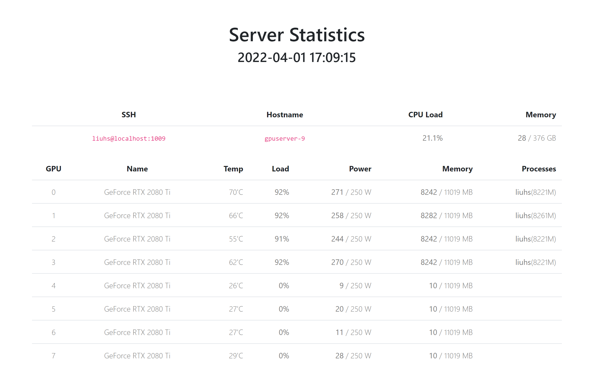

# GPU Server Monitor

Display the status of your GPU servers in a web page.



## Environment

Create the environment using `conda`:

```
conda create -n gpu-monitor-web python=3.7
conda activate gpu-monitor-web
pip install flask apscheduler markdown2 paramiko
```

Besides, make sure `gpustat` is installed on your GPU server:

```
/usr/bin/pip3 install gpustat
```


## Configurations

Generate your SSH keys and copy them to your GPU server:

```
ssh-keygen
ssh-copy-id username@hostname -p port
```

Create your configuration from the template:

```
cp config_template.py config.py
```

Save your modifications to `config.py`.

## Run

```
python main.py
```
